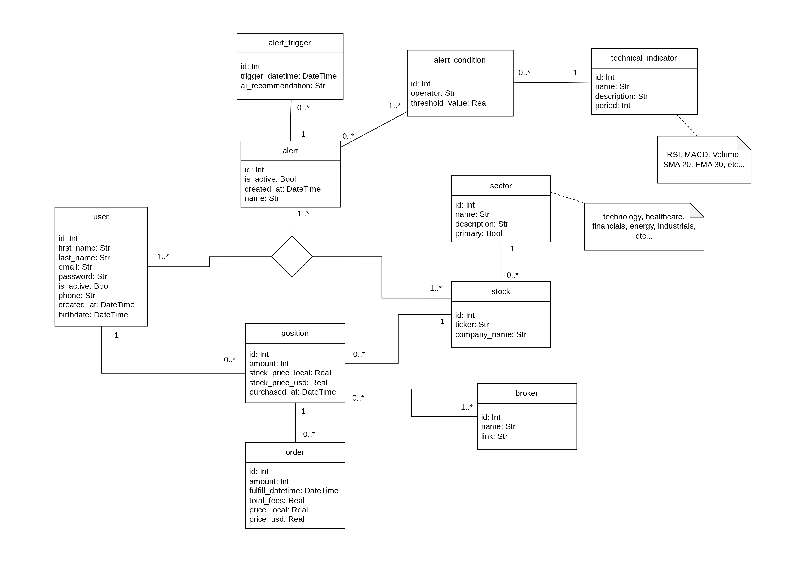
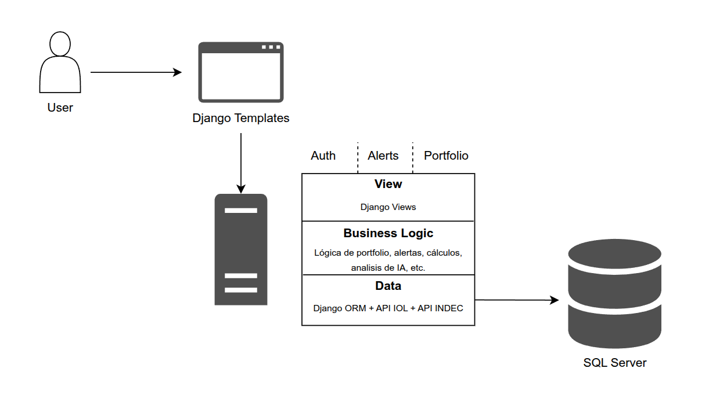

# PortfolioAR
## Descripción del proyecto
PortfolioAR es una aplicación web orientada a inversores argentinos que operan en mercados de acciones y bonos locales e internacionales a través de CEDEARs. La plataforma permite gestionar la cartera de inversiones de forma centralizada, obteniendo métricas reales de rendimiento, análisis técnico automatizado y alertas configurables basadas en indicadores financieros.

El diferencial clave del sistema es contextualizar el rendimiento de cada inversión no solo en términos absolutos, sino comparándolo contra el índice S&P 500 y contra la inflación argentina oficial del mismo periodo, respondiendo la pregunta central del inversor retail argentino: **¿le gané a la inflación?**

El sistema resuelve los siguientes problemas concretos:

- El acceso a herramientas de análisis financiero profesional en Argentina requiere mucho conocimiento sobre el mercado.
- El inversor retail no tiene una forma simple de saber si su cartera realmente le ganó a la inflación o al mercado.
- No existe una herramienta que combine seguimiento de portfolio, alertas técnicas e interpretación en lenguaje natural con IA en un solo lugar, en español y orientada a Argentina.

## Modelo de Dominio

## Bosquejo de Arquitectura

El sistema sigue una arquitectura de 3 capas:

División horizontal de responsabilidades:
- La **capa de presentación** expone vistas Django y renderiza los templates. No accede directamente a la base de datos.
- La **capa de negocio** concentra todos los cálculos de rendimiento, indicadores técnicos, evaluación de alertas e integración con LangChain. No contiene elementos de interfaz.
- La **capa de datos** gestiona todas las consultas a SQL Server mediante el Django ORM (con `mssql-django`) y las llamadas a APIs externas (IOL, INDEC).

División vertical por casos de uso:
- Auth: Gestión de usuarios (registro, login, logout y cambios de contraseña).
- Portfolio: Registro de posiciones y ordenes de venta.
- Alerts : Configuración y evaluación de alertas técnicas.

## Requerimientos

### Funcionales

**Módulo 1 – Gestión de Portfolio**

- RF01: El usuario puede registrarse, iniciar sesión y cerrar sesión.
- RF02: El usuario puede registrar operaciones de compra y venta de acciones, bonos y CEDEARs (ticker, cantidad, precio, fecha).
- RF03: El sistema calcula el rendimiento de cada posición: precio de compra vs. precio actual, ganancia/pérdida en % y en dólares, rendimiento anualizado.
- RF04: El sistema compara el rendimiento de cada posición contra el S&P 500 (SPY) para el mismo período.
- RF05: El sistema compara el rendimiento del portfolio contra la inflación acumulada del INDEC para el período de inversión.
- RF06: El sistema muestra métricas del portfolio completo: valor total invertido, valor actual, ganancia/pérdida total, alpha respecto al S&P 500, distribución por sector, análisis de correlación y volatilidad por posición.
- RF07: El sistema calcula y muestra indicadores técnicos actuales por posición.

**Módulo 2 – Alertas**

- RF09: El usuario puede configurar alertas sobre acciones con criterios técnicos: RSI > 70 / < 30, precio mayor/menor a un umbral, volumen inusualmente alto, cruce de MACD o combinaciones de indicadores. 
- RF10: El sistema evalúa periódicamente las condiciones de alerta y registra los disparos en el historial.
- RF11: El asistente IA interpreta en lenguaje natural los resultados calculados, contextualiza indicadores y compara benchmarks realizando una predicción de precio y recomendación para el usuario.

### No Funcionales

### Portability

**Obligatorios**

- El sistema funciona correctamente en múltiples navegadores (Chrome, Firefox, Edge).

### Security

**Obligatorios**

- Todas las contraseñas se guardan con encriptado criptográfico (SHA-256 o bcrypt).
- Todas las API Keys y tokens (IOL, LLM) no se exponen de manera pública (uso de variables de entorno / `.env`).

### Maintainability

**Obligatorios**

- El posee diseñarse con la arquitectura en 3 capas. (Ver [checklist_capas.md](checklist_capas.md))
- El utiliza utilizar control de versiones mediante GIT.
- El sistema está programado en Python 3.8 o superior.

### Reliability

- Se maneja correctamente la ausencia de datos para períodos sin cotización (feriados, fines de semana).

### Scalability

**Obligatorios**

- El sistema funciona desde una ventana normal y una de incógnito de manera independiente (multiusuario).
- La sesión de usuario se gestiona mediante el sistema de sesiones de Django, sin variables locales.

### Performance

**Obligatorios**

- El sistema funciona en un equipo hogareño estándar.

### Reusability

- La capa de datos expone funciones reutilizables para consultar la APIs utilizadas (IOL, INDEC), independientemente del módulo que las consuma.

### Flexibility

**Obligatorios**

- El sistema utiliza SQL Server como base de datos relacional, accedido mediante el Django ORM con el backend `mssql-django`.

## Stack Tecnológico

### Capa de Datos

- **SQL Server**: motor relacional robusto, ampliamente utilizado en entornos empresariales. Almacena todas las entidades del dominio.
- **Django ORM + mssql-django**: el ORM incluido en Django, con el backend oficial de Microsoft para SQL Server (`mssql-django`). Permite definir los modelos como clases Python y gestionar migraciones sin escribir SQL directamente, facilitando el cambio de motor de base de datos si fuera necesario.
- **API IOL (InvertirOnline)**: API REST oficial del broker argentino InvertirOnline. Requiere cuenta en IOL y autenticación por token (OAuth2). Provee cotizaciones en tiempo real e históricas de acciones, bonos y CEDEARs del mercado argentino (BYMA) e internacional. Se utiliza para obtener los precios necesarios para calcular el rendimiento de las posiciones y alimentar los snapshots diarios.
- **API INDEC (datos.gob.ar)**: API REST pública del INDEC para obtener la variación mensual del IPC nacional. Gratuita, sin autenticación. Endpoint: `https://apis.datos.gob.ar/series/api/series/?ids=148.3_INIVELNAL_DICI_M_26&format=json`

### Capa de Negocio

- **pandas**: manipulación y análisis de series temporales de precios. Central para el cálculo de métricas de rendimiento y estadísticas.
- **pandas-ta**: extensión de pandas para el cálculo de indicadores técnicos (RSI, MACD, volumen relativo, desviación estándar de retornos, etc.).
- **LangChain + LLM (GPT-4.1-mini o similar)**: asistente IA que interpreta los resultados calculados en lenguaje natural. Se utiliza LangChain para gestionar el prompt y la integración con el LLM.

### Capa de Presentación

- **Django**: framework web completo (batteries included). Se eligió por su ORM integrado, sistema de autenticación y gestión de sesiones listos para usar, panel de administración y alta demanda laboral en el mercado argentino. 
- **Django Templates**: sistema de templates incluido en Django para renderizar las vistas del portfolio, alertas y análisis. Permite migrar a React en el futuro si se desea separar el frontend.
